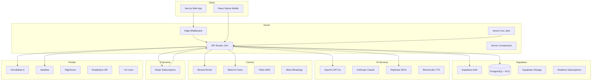
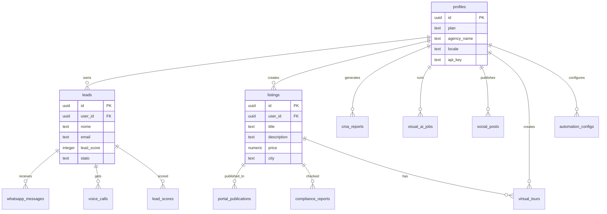

# Architecture — PropertyPilot AI

## System Overview



## Directory Structure

```
propertypilot-ai/
├── app/                          # Next.js App Router
│   ├── (marketing)/page.tsx      # Landing page
│   ├── api/                      # 115+ REST API routes
│   │   ├── v1/                   # Public API (Agency tier)
│   │   ├── stripe/               # Payment webhooks
│   │   ├── social/               # Social publishing
│   │   └── ...
│   ├── auth/                     # Login, Signup, Callback
│   ├── dashboard/                # 40+ dashboard pages
│   │   ├── ai-listings/          # AI content generation
│   │   ├── leads/                # CRM + pipeline
│   │   ├── virtual-tours/        # 3D tours
│   │   ├── campaigns/            # Email drip
│   │   ├── team/                 # Team management
│   │   └── ...
│   ├── tools/                    # Free public tools (SEO)
│   │   ├── instant-valuation/    # AVM lead magnet
│   │   ├── carbon-footprint/     # EU green incentives
│   │   └── ...
│   ├── agent/[slug]/             # Public agent profiles
│   ├── help/                     # Help center
│   ├── status/                   # System status
│   └── security/                 # Security & compliance
├── components/                   # 90+ React components
│   ├── ui/                       # shadcn/ui primitives
│   ├── copilot/                  # AI floating assistant
│   ├── negotiation/              # AI negotiation advisor
│   ├── notifications/            # Notification center
│   └── property/                 # Virtual tour embed
├── lib/                          # Core business logic
│   ├── ai/                       # OpenAI, scoring, voice tours
│   ├── cache/                    # Redis (Upstash)
│   ├── compliance/               # 6-country rule engines
│   ├── i18n/                     # 6 EU languages
│   ├── integrations/             # 12 external services
│   ├── plans/                    # Feature gating + enforcement
│   ├── portals/                  # 16 portal adapters + publisher
│   ├── virtual-tours/            # Matterport, CloudPano, 360°
│   ├── visual-ai/                # Replicate staging
│   ├── voice/                    # Bland AI, ElevenLabs, Twilio
│   └── whatsapp/                 # Meta Cloud API
├── supabase/migrations/          # 19 SQL migration files
├── types/                        # TypeScript definitions
└── apps/mobile/                  # React Native (Expo)
```

## Database Schema (Key Tables)



## API Surface

| Category | Routes | Auth | Description |
|----------|--------|------|-------------|
| Public API v1 | 5 | API Key | Listings, Leads, Health (Agency tier) |
| AI Generation | 12 | Session | Listings, descriptions, scoring, CMA |
| Stripe | 8 | Session/Webhook | Checkout, portal, subscriptions |
| Communication | 6 | Session | WhatsApp, Voice, Email |
| Social | 2 | Session | Publish, connect |
| Portals | 3 | Session | List, publish, status |
| Admin | 3 | Role | Config, force-login, diagnostics |
| Public Tools | 5 | None | Valuation, mortgage, ROI, carbon |

## Security Layers

1. **Edge Middleware:** Auth check on /dashboard/* routes
2. **API Auth:** Supabase session validation on every API call
3. **RLS:** Row-Level Security on ALL 50+ database tables
4. **Plan Gating:** Feature + usage limit enforcement (lib/plans/)
5. **Rate Limiting:** Per-endpoint + per-plan limits
6. **Webhook Verification:** Stripe signature + HMAC validation
7. **Security Headers:** HSTS, X-Frame, CSP, Permissions-Policy
8. **Encryption:** TLS 1.3 (transit), AES-256 (rest)

## External Service Dependencies

| Service | Purpose | Criticality | Fallback |
|---------|---------|-------------|----------|
| Supabase | Auth + DB | Critical | None (core) |
| Stripe | Payments | Critical | None (core) |
| OpenAI | AI Generation | Critical | Anthropic |
| Vercel | Hosting | Critical | None (core) |
| Resend | Email | High | Fallback to logs |
| Replicate | Visual AI | Medium | Graceful degradation |
| Bland AI | Voice Agent | Medium | Manual calls |
| ElevenLabs | Voice Tours | Low | Skip feature |
| Meta/TikTok | Social Publishing | Low | Manual posting |
